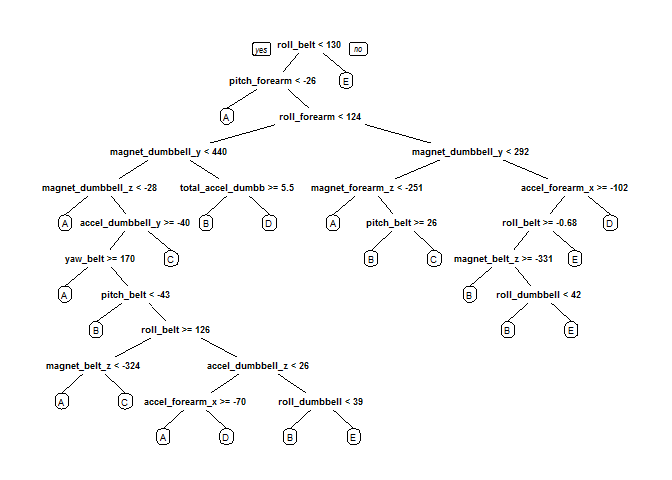
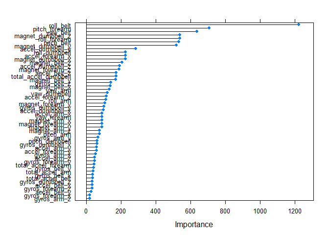

# Practical Machine Learning Course Project
Ramesh Subramanian  
Tuesday, August 18th 2015  

## How effective is your exercise? Predicting quality of exercise through Machine Learning

### Introduction:
Using devices such as Jawbone Up, Nike FuelBand, and Fitbit it is now possible to collect a large amount of data about personal activity relatively inexpensively. These type of devices are part of the quantified self movement - a group of enthusiasts who take measurements about themselves regularly to improve their health, to find patterns in their behavior, or because they are tech geeks. One thing that people regularly do is quantify how much of a particular activity they do, but they rarely quantify how well they do it. More information is available from the website here: http://groupware.les.inf.puc-rio.br/har (see the section on the Weight Lifting Exercise Dataset). 

In this project, we will use data from accelerometers on the belt, forearm, arm, and dumbell of 6 participants to predict the manner in which they did the exercise. The approach we take is:  
1.  Load the dataset  
2.  Clean the dataset and partition into training and testing data sets  
3.  Fit a model and train using cross-validation  
4.  Predict with test set and check performance measures, accuracy  
5.  Repeat steps 3 and 4 until we are satisfied with accuracy


### 1. Load all required libraries and Load the dataset

```r
library(AppliedPredictiveModeling)
library(caret)
library(e1071)
library(randomForest)
library(rpart.plot)
library(corrplot)
library(dplyr)

raw_data <- read.csv("pml-training.csv", na.strings=c("NA",""),header=TRUE)
View(raw_data)
sprintf("There are %.0f observations of %.0f variables in the raw data.",
        nrow(raw_data),ncol(raw_data))
```

```
## [1] "There are 19622 observations of 160 variables in the raw data."
```

### 2. Clean data by removing missing values and irrelevant information


```r
# Step 1: remove first 7 columns, data is not relevant, results in a dataset
# with 153 columns
clean_data <- raw_data[,8:length(colnames(raw_data))]
# step2: remove all NA columns. Dataset now has only 53 columns including the 
# colums with the "classe" variable
clean_data <- clean_data[, colSums(is.na(clean_data)) == 0]
sprintf("There are %.0f observations of %.0f variables in the cleaned data.",
        nrow(clean_data),ncol(clean_data))
```

```
## [1] "There are 19622 observations of 53 variables in the cleaned data."
```

### 3. Partition Data into Training and Testing sets, using a 60-40 split


```r
trainIndex <- createDataPartition(clean_data$classe, p=0.60, list=FALSE)
training_data <- clean_data[trainIndex,] # 11776 obs of 53 variables
testing_data <- clean_data[-trainIndex,] # 7846 obs of 53 variables
```

### 4. Set up a Model and train and predict
#### (a) start with Decision Trees and train using 5-fold cross-validation and predict using the testing data set 


```r
set.seed(400)
fitControl <- trainControl(method = "cv", number = 5)
modelFit1 <- train(training_data$classe ~ ., method="rpart", 
                   trControl=fitControl, data=training_data)
testModel1 <- predict(modelFit1, testing_data)
```

### 5. Calculate confusion Matrix to find out accuracy of Model 1 and Out of Sample Error


```r
model1Accuracy <- confusionMatrix(testing_data$classe,testModel1)
model1Accuracy
```

```
## Confusion Matrix and Statistics
## 
##           Reference
## Prediction    A    B    C    D    E
##          A 2051   23  154    0    4
##          B  657  387  474    0    0
##          C  648   24  696    0    0
##          D  579  225  482    0    0
##          E  223   78  495    0  646
## 
## Overall Statistics
##                                           
##                Accuracy : 0.4818          
##                  95% CI : (0.4707, 0.4929)
##     No Information Rate : 0.53            
##     P-Value [Acc > NIR] : 1               
##                                           
##                   Kappa : 0.3223          
##  Mcnemar's Test P-Value : NA              
## 
## Statistics by Class:
## 
##                      Class: A Class: B Class: C Class: D Class: E
## Sensitivity            0.4933  0.52510  0.30248       NA  0.99385
## Specificity            0.9509  0.84091  0.87881   0.8361  0.88938
## Pos Pred Value         0.9189  0.25494  0.50877       NA  0.44799
## Neg Pred Value         0.6247  0.94469  0.75224       NA  0.99938
## Prevalence             0.5300  0.09393  0.29327   0.0000  0.08284
## Detection Rate         0.2614  0.04932  0.08871   0.0000  0.08233
## Detection Prevalence   0.2845  0.19347  0.17436   0.1639  0.18379
## Balanced Accuracy      0.7221  0.68300  0.59064       NA  0.94161
```

```r
oose <- 1 - model1Accuracy$overall[1]
sprintf("Out of sample error using Decision Tree algorithm is %.4f",oose)
```

```
## [1] "Out of sample error using Decision Tree algorithm is 0.5182"
```

This model has an accuracy of 0.4817742 which is quite low and the model is the least accurate for outcome D. Also, the Out of Sample Error is 0.5182258 which is very high. So, we need to look for a better fit.

#### 4(b).  Model 2: Fit a random forest model on the training set, train using 5-fold cross-validation and predict using test data set.
##### Random forest is chosen because it is a very popular algorithm with high predictive accuracy and is widely used, including in Kaggle competitions.


```r
fitControl <- trainControl(method = "cv", number = 5)
modelFit2 <- train(training_data$classe ~ ., method="rf", 
                   trControl=fitControl, data=training_data)
testModel2 <- predict(modelFit2, testing_data)
```

### 5. Calculate confusion Matrix to find out accuracy of Model 2 and out of sample error


```r
model2Accuracy <- confusionMatrix(testing_data$classe,testModel2)
model2Accuracy
```

```
## Confusion Matrix and Statistics
## 
##           Reference
## Prediction    A    B    C    D    E
##          A 2230    2    0    0    0
##          B   14 1499    5    0    0
##          C    0    8 1352    8    0
##          D    0    0   27 1254    5
##          E    0    0    4    3 1435
## 
## Overall Statistics
##                                           
##                Accuracy : 0.9903          
##                  95% CI : (0.9879, 0.9924)
##     No Information Rate : 0.286           
##     P-Value [Acc > NIR] : < 2.2e-16       
##                                           
##                   Kappa : 0.9877          
##  Mcnemar's Test P-Value : NA              
## 
## Statistics by Class:
## 
##                      Class: A Class: B Class: C Class: D Class: E
## Sensitivity            0.9938   0.9934   0.9741   0.9913   0.9965
## Specificity            0.9996   0.9970   0.9975   0.9951   0.9989
## Pos Pred Value         0.9991   0.9875   0.9883   0.9751   0.9951
## Neg Pred Value         0.9975   0.9984   0.9944   0.9983   0.9992
## Prevalence             0.2860   0.1923   0.1769   0.1612   0.1835
## Detection Rate         0.2842   0.1911   0.1723   0.1598   0.1829
## Detection Prevalence   0.2845   0.1935   0.1744   0.1639   0.1838
## Balanced Accuracy      0.9967   0.9952   0.9858   0.9932   0.9977
```

```r
oose <- 1 - model2Accuracy$overall[1]
sprintf("Out of sample error using Random Forest algorithm is %.4f",oose)
```

```
## [1] "Out of sample error using Random Forest algorithm is 0.0097"
```

Accuracy of this model (in sample error) is 0.9903135 which is very high. The Out of sample error is 0.0096865. 

### Other Analysis on fitted Models 
#### 1. Plotting decision tree (model 1)

```r
treeModel <- rpart(training_data$classe ~ ., data=training_data, method="class")
prp(treeModel)
```

 

#### 2. Plotting features by importance in random forest (Model 2)


```r
importance <- varImp(modelFit2, scale=FALSE)
print(importance)
```

```
## rf variable importance
## 
##   only 20 most important variables shown (out of 52)
## 
##                      Overall
## roll_belt             1224.9
## pitch_forearm          708.1
## yaw_belt               637.2
## magnet_dumbbell_z      539.9
## roll_forearm           538.6
## pitch_belt             534.6
## magnet_dumbbell_y      519.9
## accel_dumbbell_y       286.7
## roll_dumbbell          227.6
## accel_forearm_x        226.9
## magnet_dumbbell_x      225.8
## magnet_belt_z          207.8
## accel_dumbbell_z       191.9
## magnet_forearm_z       189.0
## accel_belt_z           172.2
## total_accel_dumbbell   172.1
## magnet_belt_y          169.0
## gyros_belt_z           141.3
## magnet_belt_x          138.3
## yaw_arm                132.9
```

```r
plot(importance)
```

 

### Submission part of assignment. 
#### Load and Clean the testing data (same approach as for training data)


```r
raw_testing <- read.csv("pml-testing.csv", na.strings=c("NA",""),header=TRUE)
clean_testing <- raw_testing[,8:length(colnames(raw_testing))]
clean_testing <- clean_testing[, colSums(is.na(clean_testing)) == 0]
```

#### Test model fit on given testing (submission) data set


```r
testinganswers=predict(modelFit2, newdata=clean_testing)
testinganswers
```

```
##  [1] B A B A A E D B A A B C B A E E A B B B
## Levels: A B C D E
```
